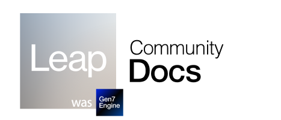

# **Leap (Gen7) Engine Guide**

Welcome to the official Gen7 Engine documentation and guide.
Before to start, it's highly recommended to read all the pages. It's short and necessary to develop your projects!

- Starting with Gen7? Check out the **Getting Started** section, and continue with **Tutorials**.
- Creating plugins to extend Gen7? Follow the guide in **Advanced** .
- Want to contribute to the docs? Share your improvements in the Github repository github.com/gen7engine-docs

### Connect

Discord: https://discord.gg/pXdeUqb  
Twitter: https://twitter.com/iyenal222  

Github: https://github.com/iyenal  
Youtube: https://www.youtube.com/@idstudioYT

Gen7 Engine is available as a public open beta for Windows and Linux OSs, and supports publishing to Windows, Linux, Wii, PSP, Switch and Gamecube.
