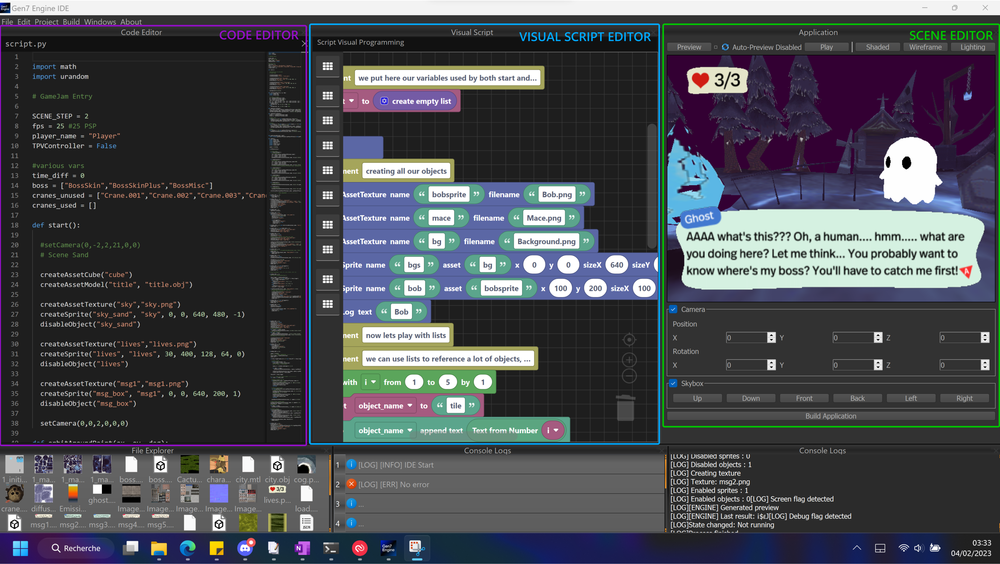

# Quick start

You downloaded Gen7 Engine and now you're ready to enter the beautiful world of homebrews? Welcome!

Start by running the IDE (IDE.exe):

You'll find several windows, each dedicated to a part of your project! Let's see what they're linked to:

- Script Editor: this is the code editor you'll use to create and modify your project source code in Python (and it's the same editor behind Visual Studio Code! :)
- Visual Programming Editor: you can also create your project's logic only with blocks

> To save, use Ctrl+S in the Script Editor to save the script, and the same key in Visual Programming Editor to save the blocks logic .
> Warning, any save in the Script Editor will overwrite the Visual Programming Editor logic (which is translated to Python at every save), and same for the VPE.
> They're not complementary. However you can integrate Python code into your logic blocks with the Python block.

- Graphics Editor:
	- Top buttons: Preview (refresh below preview), Play, Automatic Preview (to automatically refresh the game preview at any change), and Graphics rendering properties
	- Central panel: Your project's current camera preview
	- Camera panel: the default camera coordinates (overwritten by enabled cameras in blocks/script).
	- Skybox: skybox assets to be used on the current scene.
	
- Project Inspector: your project files and assets
- Visual Logs: IDE-related logs
- Project Logs: your project and engine logs for informative and debugging purposes.

> We can open other projects with File/Open Projects.
> By default, it opens the project in "project" folder next to IDE executable.

Now let's start by creating a simple project:

[TODO: Add screens and description]
