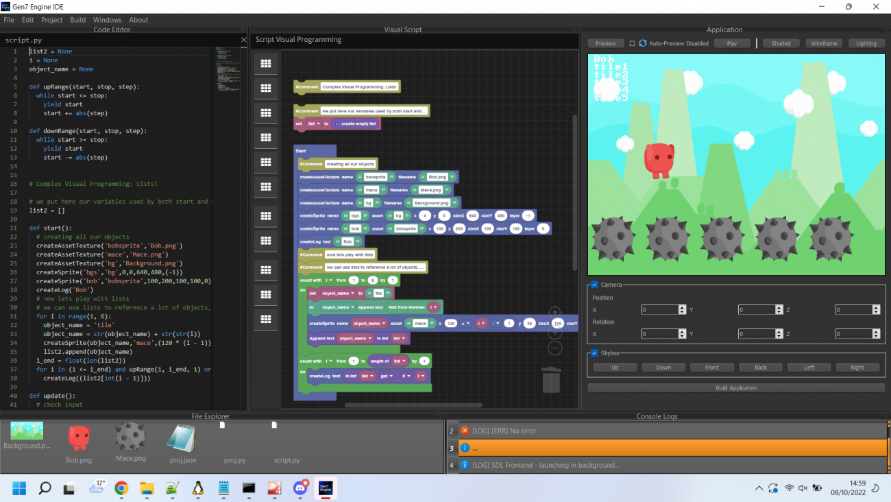
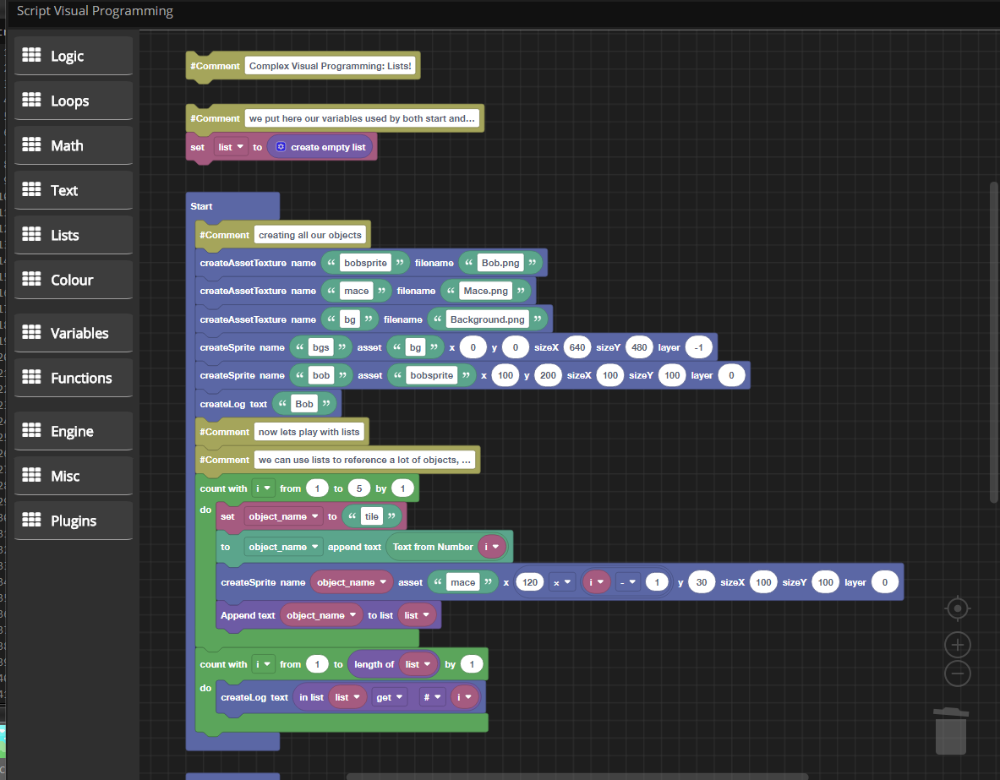
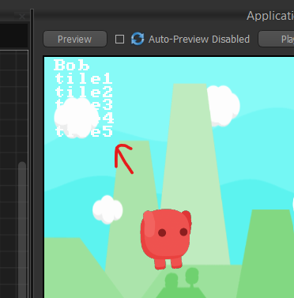
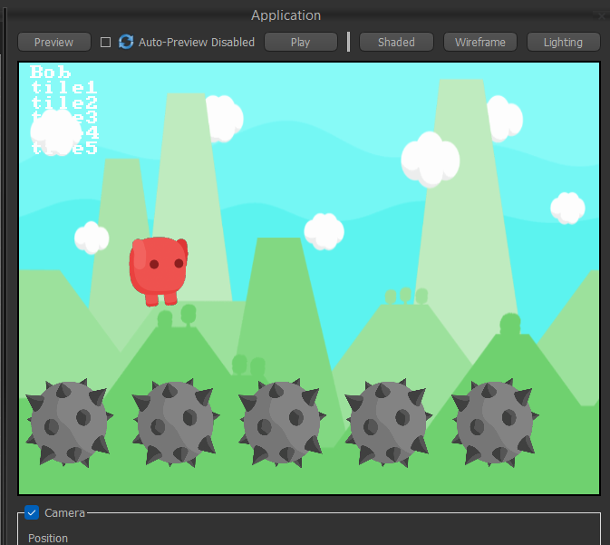
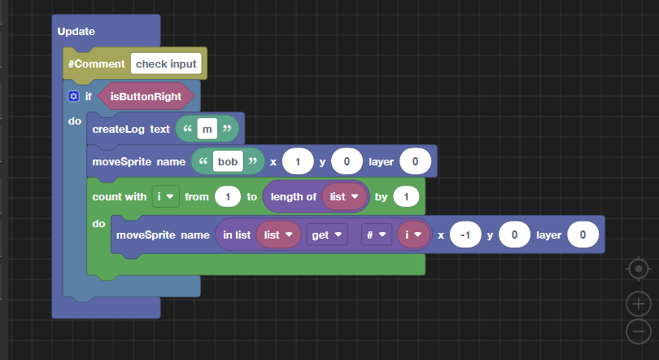
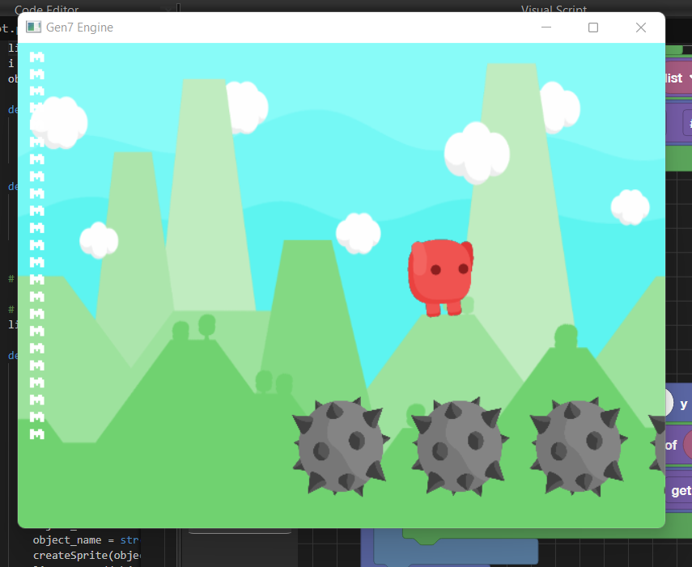

**Example: Create procedurally objects**

In this example, we'll use lists to create procedurally objects.  
This project is included in your Gen7 folder.

## Project overview:

We have imported 3 sprites in our project (see File Explorer), and rearranged the layout to the following.  
We can enable too the Auto-Preview feature to immediately see any changes in live.

[]

## Our visual programming script

**On start:**

We create a global list, creating and storing our procedurally created objects (the maces) in **Start** block, and manipulating them later in **Update** block.

We set up our scene with a background and a player, and then a loop to create our procedural objects with an unique name, stored in the previously created list.  
For debug purposes, we log the name of our objects stored in the array just after to check their conformity:

We have now tile1 to tile5 objects, rendered as the 5 maces at the bottom of our scene.

**On update:**

At every update, we check if the button Right is pressed, and we move the player and our sprites generated procedurally together by referring to the list storing their names.

## Let's test!

We play our application to check our behaviour:

It's working great!
